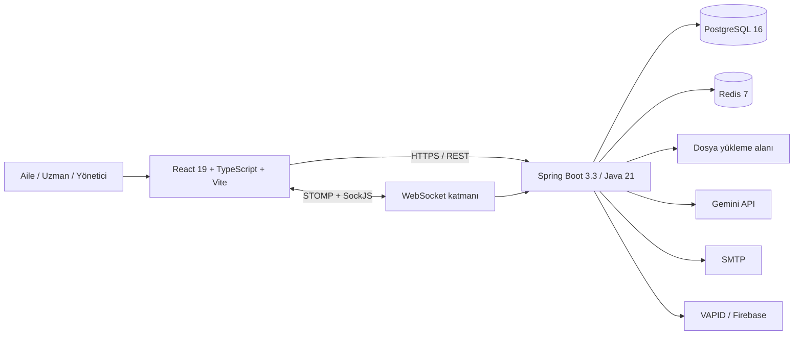

# Otizm Destek Platformu — Güncel Projelendirme ve Durum Dokümanı

> İnceleme tarihi: 15 Temmuz 2026
>
> İncelenen sürüm: `main` / `a2d858a`
>
> Belgenin amacı: Kod tabanında bugün gerçekten bulunan kapsamı, doğrulanmış kalite durumunu ve yayına kadar kalan işleri tek yerde göstermek.

## 1. Yönetici Özeti

Otizm Destek Platformu; otizmli çocukların ailelerini, uzmanları ve platform yöneticilerini aynı sistemde buluşturan web tabanlı bir destek, takip ve iletişim ürünüdür. Çocuk gelişimi ve günlük yaşam kayıtları, uzman-aile iş birliği, randevu, görev, topluluk, bilgi bankası, bildirim ve yönetim süreçleri geniş ölçüde uçtan uca uygulanmıştır.

Proje artık temel özellik geliştirme aşamasından çok **yayın öncesi sağlamlaştırma aşamasındadır**. Fonksiyonel kapsam geniş ve frontend üretim derlemesi alınabilmektedir; ancak mevcut lint hataları, sınırlı E2E kapsamı, bu incelemede Java 21 ortamında tekrar doğrulanamayan backend testleri ve operasyonel hazırlık eksikleri nedeniyle ürün henüz koşulsuz olarak “üretime hazır” kabul edilmemelidir.

Güncel öncelik sırası:

1. Kalite kapılarını tamamen yeşil hale getirmek.
2. Kritik kullanıcı akışlarını entegrasyon ve E2E testleriyle güvenceye almak.
3. Üretim yapılandırması, gözlemlenebilirlik, yedekleme/geri yükleme ve geri alma süreçlerini doğrulamak.
4. Arama sözleşmesi ve çoklu dil gibi bilinen fonksiyonel eksikleri tamamlamak.

## 2. Ürün Amacı ve Hedef Kitle

### 2.1 Ürün amacı

Platformun amacı, ailelerin farklı araçlarda tuttuğu gelişim ve günlük yaşam verilerini tek yerde toplamak; bu verileri yetkilendirilmiş uzmanlarla güvenli biçimde paylaşmak; ailelerin bilgiye, topluluğa ve profesyonel desteğe erişimini kolaylaştırmaktır.

Platform tıbbi tanı koyan veya sağlık profesyonelinin yerini alan bir sistem değildir. Yapay zekâ çıktıları ve içerikler destekleyici nitelikte ele alınmalı; kritik sağlık kararları için profesyonel değerlendirme gerekliliği korunmalıdır.

### 2.2 Kullanıcı rolleri

| Rol | Temel kullanım alanı |
|---|---|
| Aile / Ebeveyn (`PARENT`) | Çocuk profili, günlük takip, tedavi/rutin/görev, uzman ve randevu, topluluk, bilgi bankası |
| Uzman (`EXPERT`) | Danışan bağlantıları, çocuk verilerine yetkili erişim, görev ve geri bildirim, BEP, randevu ve içerik üretimi |
| Yönetici (`ADMIN`) | Kullanıcı ve uzman onayı, içerik moderasyonu, şikâyetler, denetim kayıtları, sistem ayarları ve metrikler |

Frontend rotaları role göre ayrılmıştır. Backend tarafında genel JWT korumasına ek olarak servis/controller seviyesinde yetki ve sahiplik kontrolleri kullanılmaktadır.

## 3. Mevcut Kod Tabanının Sayısal Görünümü

| Alan | Güncel durum |
|---|---:|
| Backend controller sınıfı | 55 |
| Backend servis sınıfı | 66 |
| Backend model sınıfı | 76 |
| Backend repository arayüzü | 74 |
| HTTP endpoint eşlemesi | 313 |
| Frontend sayfa bileşeni | 48 |
| Frontend route tanımı | 75 |
| Flyway migration dosyası | 41; en güncel sürüm V42 |
| Backend test sınıfı | 18 |
| Frontend birim test dosyası | 5 |
| Frontend E2E test dosyası | 1 |
| GitHub Actions workflow'u | 3 |

Not: Migration numaraları V1–V42 aralığındadır; V21 numarası kullanılmadığı için toplam dosya sayısı 41'dir.

## 4. Fonksiyonel Kapsam ve Güncel Durum

Durumların anlamı:

- **Uygulandı:** Backend ve frontend karşılığı kod tabanında mevcut.
- **Koşullu:** Özellik mevcut, fakat harici servis/anahtar veya ek operasyonel doğrulama gerektiriyor.
- **Kısmi:** Akışın bir bölümü uygulanmış, bilinen sözleşme ya da deneyim eksiği var.
- **Yok:** Kod tabanında karşılığı bulunmuyor.

| Modül | Durum | Mevcut kapsam |
|---|---|---|
| Kimlik doğrulama ve hesap | Uygulandı | Kayıt, giriş, JWT access/refresh token, çıkış, şifre değiştirme, şifre sıfırlama, profil güncelleme, veri dışa aktarma ve hesap silme |
| Rol ve erişim yönetimi | Uygulandı | Aile, uzman ve yönetici rolleri; route koruması; çocuk/danışan sahiplik ve bağlantı kontrolleri |
| Başlangıç deneyimi | Uygulandı | Aile ve uzman kayıt akışları, onboarding, etkileşimli ürün turu ve kullanıcı rehberi |
| Çocuk profili | Uygulandı | Profil, tanı/eğitim/terapi bilgileri, fotoğraf, etiketler, gelişim notları ve kilometre taşları |
| Günlük takip | Uygulandı | Duygu durumu, uyku, ilaç/doz günlüğü, beslenme, ebeveyn refahı ve davranış/ABC kayıtları |
| Tedavi ve gelişim araçları | Uygulandı | Tedavi durumu, hedefler, rutinler, sosyal hikâyeler, mini egzersizler, görevler ve görev teslimi |
| Duyusal ve okul takibi | Uygulandı | Duyusal profil, okul günlüğü ve uzman/aile yanıtlaşması |
| Analiz ve raporlama | Uygulandı | Eğilim grafikleri, gelişim özetleri, PDF raporu, BEP raporu ve paylaşılabilir ilerleme kayıtları |
| Yapay zekâ içgörüleri | Koşullu | Çocuk verilerinden içgörü, davranış analizi, korelasyon anlatımı ve PDF; Gemini anahtarı ve veri yeterliliği gerektirir |
| Yapay zekâ sohbeti | Koşullu | Normal ve SSE akışlı sohbet; Gemini erişimi olmadığında kontrollü hata/fallback davranışı |
| Uzman keşfi | Uygulandı | Uzman listeleme, filtreleme, profil, değerlendirme, kurum bilgisi ve müsaitlik |
| Uzman-danışan bağlantısı | Uygulandı | Erişim isteği, kabul/ret/iptal/geri alma, aktif danışanlar ve klinik veri paylaşımı |
| Randevu | Uygulandı | Müsaitlik, slot engelleme, oluşturma, onay, erteleme, iptal, tekrarlayan seans, tamamlama, not ve değerlendirme |
| Takvim ve hatırlatmalar | Uygulandı | Takvim olayları; randevu, ilaç, rutin ve görev için zamanlanmış bildirimler |
| Mesajlaşma | Uygulandı | Birebir ve grup konuşması, mesaj arama, okundu bilgisi, tepki, sessize alma, arşivleme ve üye yönetimi |
| Gerçek zamanlı iletişim | Uygulandı | STOMP/SockJS WebSocket, kullanıcı kuyruğu, grup konuları ve JWT kanal doğrulaması |
| Bildirim ve push | Koşullu | Uygulama içi bildirim, Web Push/VAPID ve Firebase cihaz tokenı; gerçek teslimat ilgili anahtarların tanımlanmasına bağlı |
| Forum ve destek duvarı | Uygulandı | Gönderi, soru/cevap, yorum, anonim paylaşım, oylama, kabul edilen cevap ve şikâyet |
| Gruplar ve topluluk | Uygulandı | Grup oluşturma/katılma, doğrulama, üye yönetimi, yasaklama, grup toplantıları ve sohbet |
| Benzer aileler ve buddy | Uygulandı | Benzerlik/konum tabanlı keşif, eşleşme isteği, kabul/ret, yakındaki kullanıcılar ve buluşma isteği |
| Topluluk buluşmaları | Uygulandı | Buluşma listeleme, katılma/ayrılma ve topluluk etkinliği akışı |
| Haftalık soru | Uygulandı | Haftalık konu, tekil cevap kısıtı, beğeni ve yönetici tarafında AI ile soru üretimi |
| Bilgi bankası | Uygulandı | Makale, video, podcast ve hikâye formatları; kategori, arama, öneri, ilişkili içerik, yer imi ve yorum |
| İçerik üretimi/moderasyonu | Uygulandı | Uzman içeriği, taslak/yayın, AI taslağı, yönetici onay/ret süreci ve harici içerik içe aktarma |
| Acil durum kartı | Uygulandı | Düzenlenebilir kart, QR kod ve kimlik doğrulamasız paylaşılabilir acil profil |
| Yönetim paneli | Uygulandı | Özet, büyüme analitiği, kullanıcılar, uzman onayı/lisans doğrulama, içerik, şikâyet, audit log ve ayarlar |
| Veritabanı yedeği | Koşullu | Yönetici endpoint'i gerçek `pg_dump` çıktısı üretir; container içinde PostgreSQL istemcisi vardır. Otomatik takvim ve geri yükleme tatbikatı yoktur |
| PWA | Uygulandı | Manifest, service worker, çevrimdışı sayfası, kurulum istemi ve mobil ikonlar |
| Genel arama | Kısmi | Gönderi, makale, grup ve uzmanlarda PostgreSQL full-text/ILIKE araması; tür, tarih ve kategori desteği |
| Etiket bazlı genel arama | Kısmi | API `tags` parametresini alıyor fakat `SearchService` bu filtreyi sorguya uygulamıyor; frontend arama sözleşmesinde de etiket alanı yok |
| Arama sıralaması | Kısmi | Frontend `sort` parametresini gönderiyor; backend controller bunu almıyor ve sonuçları sabit olarak ilgililik/tarihe göre sıralıyor |
| Çoklu dil | Yok | Arayüz, tarih biçimi ve AI istemleri Türkçe odaklı; i18n altyapısı ve dil seçimi bulunmuyor |

## 5. Sistem Mimarisi

### 5.1 Frontend

- React 19, TypeScript 6 ve Vite 8.
- React Router ile lazy-loaded sayfa rotaları.
- TanStack Query ile sunucu durumu ve önbellek.
- Zustand ile kimlik, seçili çocuk ve toast durumu.
- React Hook Form + Zod ile form yönetimi/doğrulama.
- Tailwind CSS 4 tabanlı responsive arayüz.
- Recharts ile analitik grafikler.
- STOMP/SockJS ile gerçek zamanlı olaylar.
- Vitest, Testing Library ve Playwright test altyapısı.

### 5.2 Backend

- Java 21 ve Spring Boot 3.3.5.
- Spring MVC, Spring Security, Spring Data JPA ve Bean Validation.
- JWT tabanlı stateless kimlik doğrulama.
- PostgreSQL + Flyway migration yönetimi.
- Redis tabanlı önbellek/rate limit; Redis yoksa bellek içi rate limit fallback'i.
- STOMP/SockJS WebSocket mesajlaşması.
- OpenPDF ile PDF üretimi.
- Spring Mail, Web Push ve Firebase Admin entegrasyonları.
- Actuator, Micrometer ve Prometheus metrikleri.
- springdoc OpenAPI/Swagger; üretimde kapalı, diğer ortamlarda admin erişimli.

### 5.3 Veri ve migration yönetimi

- Şema değişiklikleri Flyway üzerinden yönetilmektedir.
- Son migration `V42__article_tags.sql` ile bilgi bankası makale-etiket ilişkisi eklenmiştir.
- Üretimde `ddl-auto=validate` kullanılarak entity-şema uyumu kontrol edilmektedir.
- Uygulama dosyaları kalıcı Docker volume'ünde, ilişkisel veriler PostgreSQL'de tutulmaktadır.

## 6. Güvenlik ve Mahremiyet Durumu

Kod tabanında mevcut güvenlik kontrolleri:

- BCrypt parola özeti.
- 15 dakikalık access token ve 7 günlük refresh token yapılandırması.
- Refresh token yenileme/kullanım takibi.
- Role dayalı ve kaynak sahipliğine dayalı erişim kontrolleri.
- CORS allowlist.
- HTTP ve WebSocket JWT doğrulaması.
- Rate limit altyapısı.
- Merkezi exception handler ve tutarlı API hata gövdesi.
- HTML sanitizasyonu.
- 10 MB dosya yükleme sınırı.
- Audit log ve yönetici aktivite görünümü.
- Üretim başlangıcında zayıf/varsayılan güvenlik ayarlarını denetleyen başlangıç kontrolü.
- Nginx üzerinde TLS 1.2/1.3, HSTS ve temel güvenlik başlıkları.
- Kullanıcının kendi verisini dışa aktarma ve hesabını silme uçları.

Yayın öncesi ayrıca doğrulanması gerekenler:

- KVKK veri envanteri, açık rıza, saklama süresi ve silme prosedürlerinin kod dışı süreçlerle eşleştirilmesi.
- Çocuk/sağlık verilerinin Gemini veya diğer harici servislere gönderilmeden önce veri minimizasyonu ve hukuki dayanağı.
- Yüklenen dosyalarda MIME/içerik doğrulama, zararlı dosya taraması ve yetkisiz doğrudan erişim testi.
- IDOR, yetki yükseltme, refresh token tekrar kullanımı ve WebSocket kanal aboneliği için penetrasyon testleri.
- Üretim secret rotasyonu ve hiçbir varsayılan geliştirme parolasının kullanılmadığının doğrulanması.
- Acil durum kartının herkese açık bağlantısı için açık kullanıcı onayı, iptal ve süre sonu yaklaşımı.

## 7. Dağıtım ve Operasyon

### 7.1 Yerel geliştirme

`docker-compose.yml` aşağıdaki servisleri birlikte çalıştırır:

- PostgreSQL 16.2
- Redis 7.2
- Spring Boot backend
- Vite geliştirme sunuculu frontend
- Kalıcı PostgreSQL, Redis ve upload volume'leri

### 7.2 Üretim

`docker-compose.prod.yml` ve üretim Dockerfile'ları şunları sağlar:

- Java 21 JRE üzerinde backend.
- Nginx üzerinde statik frontend.
- HTTP'den HTTPS'e yönlendirme.
- Let's Encrypt/Certbot sertifika alma ve yenileme.
- API ve WebSocket reverse proxy.
- Container healthcheck'leri.
- PostgreSQL, Redis ve upload verileri için kalıcı volume'ler.

### 7.3 CI/CD

Depoda üç GitHub Actions workflow'u vardır:

| Workflow | İşlev |
|---|---|
| Backend CI | Java 21 ile `mvn verify` ve backend Docker image build |
| Frontend CI | Kurulum, lint, birim testi, Playwright E2E ve üretim build |
| Deploy | `main` üzerinde backend/frontend image'larını GHCR'a gönderme; değişken açıksa SSH ile sunucu deploy'u |

İncelenen commit için GitHub birleşik durumunda Vercel kontrolü başarılı görünmektedir. GitHub Actions'ın en son çalışma sonucu bu incelemede kesin olarak alınamadığı için yerel doğrulama sonuçları aşağıda ayrıca verilmiştir.

Operasyonel not: Deploy workflow'u GHCR image'larını yayınlıyor; ancak SSH adımı sunucuda tekrar kaynak koddan `docker compose ... --build` çalıştırıyor. Tekrarlanabilir deploy ve hızlı rollback için üretim compose'unun SHA etiketli GHCR image'larını doğrudan tüketmesi daha güvenli olacaktır.

## 8. Doğrulanmış Kalite Durumu

15 Temmuz 2026 tarihinde yapılan yerel kontroller:

| Kontrol | Sonuç | Açıklama |
|---|---|---|
| Frontend üretim derlemesi | Geçti | TypeScript build ve Vite production bundle başarılı |
| Frontend birim testleri | Geçti | 5 dosyada 18/18 test başarılı |
| Frontend E2E | Geçti | 1/1 Chromium duman testi başarılı |
| Frontend lint | Kaldı | 5 hata ve 5 uyarı |
| Backend testleri | Doğrulanamadı | Yerel Maven Java 25 ile Lombok/javac uyumsuzluğu verdi; Java 21 Docker yardımcısı Docker daemon kapalı olduğu için çalışmadı |

Mevcut lint hataları:

- `TreatmentToolsTab.tsx`: kullanılmayan iki ikon import'u.
- `api.ts`: üç adet açık `any` kullanımı.

Mevcut lint uyarıları ağırlıklı olarak React hook bağımlılıkları ve effect cleanup içindeki ref kullanımıyla ilgilidir.

Backend sonucu bir uygulama testi başarısızlığı olarak yorumlanmamalıdır; testler daha başlamadan yanlış JDK sürümünde derleme aşamasında durmuştur. Yayın kararı için Java 21 altında `mvn verify` sonucunun yeniden alınması zorunludur.

### Test kapsamı değerlendirmesi

- Backend tarafında auth, çocuk, refah, randevu, mesajlaşma, forum, eşleşme, AI içgörü ve bazı admin servisleri için testler vardır.
- Frontend testleri auth/çocuk/refah servisleri, tedavi durumu ve tarih yardımcılarıyla sınırlıdır.
- Tek E2E testi yalnızca uygulamanın açılması, başlık ve body görünürlüğünü kontrol eder.
- Kayıt-giriş, rol yönlendirmesi, çocuk oluşturma, uzman bağlantısı, randevu, mesajlaşma ve admin moderasyonu için uçtan uca senaryolar henüz yeterli değildir.

## 9. Bilinen Teknik ve Ürün Borçları

### Kritik

- Frontend CI'da lint adımı mevcut kodla başarısız olur.
- Backend test sonucu bu çalışma ortamında Java 21 altında doğrulanmış değildir.
- Kritik akışlar için E2E kapsamı çok düşüktür.
- Üretim yedek dosyası alınabiliyor olsa da otomatik yedek takvimi, harici saklama, geri yükleme otomasyonu ve tatbikat kaydı yoktur.

### Yüksek

- Genel aramada `tags` parametresi kabul edilmesine rağmen uygulanmıyor.
- Frontend/backend arama `sort` sözleşmesi uyumsuz.
- STOMP simple broker tek backend instance'ı için uygundur; yatay ölçeklemede harici broker/relay gerektirir.
- Prometheus metrikleri mevcut, fakat depoda alarm, dashboard veya olay müdahale tanımı yok.
- Üretim deploy'u yayınlanan immutable GHCR image'ı yerine sunucuda yeniden build alıyor.
- Harici AI ve bildirim özelliklerinin eksik anahtarlarla davranışı staging ortamında uçtan uca doğrulanmalıdır.

### Orta

- Çoklu dil altyapısı yok.
- Frontend bundle içinde büyük vendor parçaları vardır; rota bazlı lazy-loading uygulanmış olsa da performans bütçesi tanımlı değildir.
- Bazı sayfalarda demo/fallback verileri bulunur; gerçek kullanıcı akışında ne zaman devreye girdikleri ürün kabul testinde doğrulanmalıdır.
- Türkçe full-text aramada `simple` sözlük kullanılmaktadır; Türkçe dil sözlüğü/stemming kalitesi değerlendirilmemiştir.

## 10. Güncel Yol Haritası

### Faz 0 — Kalite kapısını açma

Hedef: Mevcut kodu değiştirmeden önce CI'nın güvenilir bir yayın göstergesine dönüşmesi.

- 5 lint hatasını ve hook uyarılarını gidermek.
- Java 21 ortamında tüm backend testlerini çalıştırmak.
- Backend ve frontend workflow'larını branch protection için zorunlu kontrol yapmak.
- Test raporu ve mümkünse coverage çıktısını CI artifact'i olarak saklamak.
- Minimum coverage eşiğini gerçekçi bir başlangıç değeriyle tanımlamak.

Çıkış ölçütü: Frontend lint/test/build/E2E ile backend `mvn verify` aynı commit üzerinde başarılı.

### Faz 1 — Kritik akışların güvenceye alınması

Hedef: Kullanıcı kaybı veya mahremiyet ihlali oluşturabilecek akışları otomatik test altına almak.

- Kayıt, giriş, token yenileme ve şifre sıfırlama.
- Aile rolünde çocuk oluşturma ve sahiplik kontrolü.
- Uzman erişim isteği ve onay/ret.
- Randevu oluşturma, onay, erteleme ve iptal.
- Görev atama, teslim ve uzman geri bildirimi.
- Mesaj gönderme, okundu bilgisi ve yetkisiz konuşma erişimi.
- Admin uzman onayı ve şikâyet moderasyonu.
- Dosya yükleme ve açık acil kart için güvenlik senaryoları.

Çıkış ölçütü: Kritik mutlu yollar ve temel yetkisiz erişim senaryoları CI'da otomatik çalışıyor.

### Faz 2 — Bilinen fonksiyonel eksikleri kapatma

Hedef: Frontend ile backend arasındaki açık sözleşme farklarını gidermek.

- Aramada gerçek etiket JOIN/filtre sorgusunu uygulamak.
- `sort` parametresini backend'de desteklemek veya frontend sözleşmesinden kaldırmak.
- Arama pagination ve toplam sonuç bilgisini değerlendirmek.
- i18n çekirdeğini kurmak; yeni metinleri çeviri anahtarlarıyla yazmak.
- Türkçe arama sözlüğünü gerçek veriyle karşılaştırmalı test etmek.

Çıkış ölçütü: Arama filtreleri API ve arayüzde aynı davranıyor; i18n altyapısı en az Türkçe için devrede.

### Faz 3 — Üretim hazırlığı

Hedef: Tekrarlanabilir, izlenebilir ve geri alınabilir yayın.

- Ayrı staging ortamı kurmak.
- Üretim secret'larını secret manager veya güvenli CI secret akışıyla yönetmek.
- SHA etiketli GHCR image'larıyla deploy ve önceki image'a rollback.
- Otomatik PostgreSQL yedeği, harici/şifreli saklama ve geri yükleme tatbikatı.
- Prometheus dashboard'ları, hata oranı/gecikme/kaynak kullanımı alarmları.
- Merkezi log toplama ve correlation/request ID.
- API ve WebSocket yük testlerini gerçekçi eşzamanlı kullanıcı senaryolarıyla çalıştırmak.
- KVKK, güvenlik ve erişilebilirlik kabul kontrollerini tamamlamak.

Çıkış ölçütü: Staging'den üretime onaylı deploy, doğrulanmış rollback ve başarıyla tamamlanmış restore tatbikatı.

### Faz 4 — Ölçek ve büyüme

Hedef: Stabil ürünün erişimini ve kullanım kalitesini artırmak.

- Tam kapsamlı çoklu dil ve dil seçim deneyimi.
- Harici WebSocket broker/relay ile yatay ölçek.
- İçerik ve uzman önerilerinin ölçülebilir biçimde iyileştirilmesi.
- Arama kalitesi, typo toleransı ve gelişmiş keşif.
- Performans bütçeleri ve Core Web Vitals takibi.
- Kullanıcı geri bildirimleriyle onboarding ve erişilebilirlik iyileştirmeleri.

## 11. Yayına Hazır Tanımı

Ürünün “yayına hazır” kabul edilmesi için aşağıdaki koşullar birlikte sağlanmalıdır:

- Tüm zorunlu CI kontrolleri yeşil.
- Kritik E2E ve yetkilendirme senaryoları geçiyor.
- Açık kritik/yüksek güvenlik bulgusu yok.
- Üretim secret'ları ve harici servis anahtarları doğrulanmış.
- Migration, yedek ve geri yükleme tatbikatı başarılı.
- İzleme, alarm ve olay müdahale sorumluları tanımlı.
- Rollback adımı denenmiş.
- KVKK ve tıbbi uyarı metinleri gerçek veri akışlarıyla uyumlu.
- AI/push/e-posta servisleri staging'de gerçek entegrasyonla test edilmiş.
- Ürün sahibi temel aile, uzman ve admin kabul senaryolarını onaylamış.

## 12. Sonuç

Otizm Destek Platformu, prototip seviyesini aşmış ve geniş fonksiyonel kapsama ulaşmış bir tam yığın uygulamadır. Bugünkü ana ihtiyaç yeni modül eklemekten önce mevcut özellikleri ölçülebilir kalite kapıları, daha güçlü uçtan uca testler ve doğrulanmış üretim operasyonlarıyla güvenceye almaktır. Bu nedenle en doğru kısa vadeli hedef, projeyi “özellik açısından kapsamlı” durumdan “kanıtlanabilir biçimde yayınlanabilir” duruma taşımaktır.
