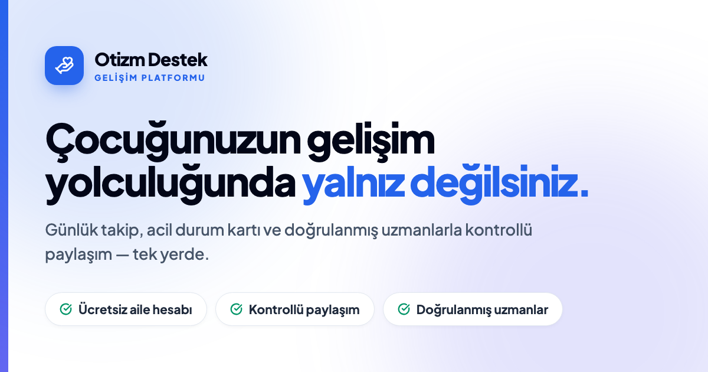

<div align="center">
  

  <h1>Otizm Destek Platformu 🧩</h1>
  <p>
    Otizmli çocukların ebeveynlerini, uzmanları (terapist/doktor) ve platform yöneticilerini tek bir çatı altında buluşturan web tabanlı gelişim takip ve destek platformudur.
  </p>
  <p><b>Aileleri ve uzmanları; gelişim takibi, iletişim ve günlük destek araçlarıyla aynı güvenli platformda buluşturur.</b></p>

  <!-- Badges -->
  <p>
    
    
    
    
    
    
  </p>
</div>

---

## 📑 İçindekiler
- [🚀 Öne Çıkan Özellikler](#-öne-çıkan-özellikler)
- [🛠️ Teknoloji Yığını](#️-teknoloji-yığını)
- [🏗️ Mimari](#️-mimari)
- [🚀 Kurulum ve Çalıştırma](#-kurulum-ve-çalıştırma)
- [🗄️ Veritabanı ve Ortam Değişkenleri](#️-veritabanı-ve-ortam-değişkenleri)
- [🔒 Gizlilik ve Güvenlik](#-gizlilik-ve-güvenlik)
- [🤝 Katkıda Bulunma](#-katkıda-bulunma)

---

## 🚀 Öne Çıkan Özellikler

| Özellik | Açıklama |
| :--- | :--- |
| 📊 **Gelişim Paneli** | Ruh hâli, uyku, kilometre taşları ve tarama sonuçlarını görsel grafiklerle izleme (Recharts ile). |
| 🤖 **Yapay Zeka Analisti** | **Gemini AI** entegrasyonu ile (kullanıcı rızasına bağlı) gelişim verilerinin akıllı özeti ve ABC davranış örüntüsü analizleri. |
| 🗓️ **Günlük Takip & Rutinler** | Rutin, ilaç, beslenme, okul günlüğü ve duyusal profil kayıtları oluşturabilme. |
| 👨‍⚕️ **Uzman & Danışan Yönetimi** | Danışan yönetimi, randevu, görev, özel not ve **BEP (Bireyselleştirilmiş Eğitim Planı)** raporu akışları. |
| 💬 **Mesajlaşma & Topluluk** | Aile-uzman arası güvenli mesajlaşma (WebSocket destekli), bilgi paylaşım forumu, yerel buluşmalar ve dertleşme duvarı. |
| 🆘 **Acil Durum & Kriz Yönetimi**| Kriz rehberi, sosyal öyküler ve kriz anlarında paylaşılabilir **Acil Durum Kartı**. |

> **Not:** Bu yazılım tıbbi tanı veya tedavinin yerini almaz. Klinik kararlar için yetkili sağlık profesyonellerine başvurulmalıdır.

---

## 🛠️ Teknoloji Yığını

| Katman | Teknolojiler |
| :--- | :--- |
| **Web arayüzü** | React 19, TypeScript, Vite, Tailwind CSS 4, Lucide React İkonları |
| **İstemci durumu** | TanStack Query (v5), Zustand, React Hook Form, Zod, Recharts |
| **Backend** | Java 21, Spring Boot 3.3, Spring Security, JWT, WebSocket |
| **Veri & Önbellek** | PostgreSQL 16, Redis, Flyway, JPA |
| **Dosya ve Bildirim** | S3 uyumlu depolama, Firebase, Web Push, SMTP |
| **Test** | Vitest, Playwright, Spring Boot Test, Testcontainers |
| **Dağıtım** | Docker Compose, Nginx, Vercel/Render yapılandırmaları |

---

## 🏗️ Mimari

```text
otizm-destek-platformu/
├── frontend/                  # 🎨 React + TypeScript istemcisi
│   ├── src/pages/             # Kullanıcı ve uzman ekranları
│   ├── src/components/        # Yeniden kullanılabilir UI bileşenleri
│   └── src/services/          # API istemcileri
├── backend/                   # ⚙️ Spring Boot API
│   └── src/main/
│       ├── java/              # Controller, service ve domain katmanları
│       └── resources/         # Uygulama ayarları ve Flyway migrasyonları
├── docker-compose.yml         # 🐳 Yerel geliştirme servisleri
└── docker-compose.prod.yml    # 🚀 Üretim ortamı servisleri
```

---

## 🚀 Kurulum ve Çalıştırma

Projeyi yerel ortamınızda çalıştırmak için aşağıdaki adımları izleyebilirsiniz.

### 🐳 1. Docker ile Hızlı Başlatma (Önerilen)

Tüm servisleri (PostgreSQL, Redis, Backend, Frontend) tek bir komutla ayağa kaldırmak en kolay yoldur.

**Gereksinimler:** Docker ve Docker Compose, Git

```bash
git clone https://github.com/EnesKotay/otizm-destek-platformu.git
cd otizm-destek-platformu
docker compose up -d --build
```
_Uygulama varsayılan olarak `http://localhost:5173` adresinde açılır._

AI, gerçek e-posta ve bildirim özellikleri için `.env.example` dosyasını `.env` adıyla kopyalayıp ilgili değerleri doldurun.

### 💻 2. Yerel Geliştirme (Local Development)

Önce veri servislerini başlatın:
```bash
docker compose up -d postgres redis
```

**Backend (Java / Spring Boot):**
```bash
cd backend
./mvnw spring-boot:run
```
_API servisi `http://localhost:8080` adresinde çalışacaktır. (OpenAPI Dokümantasyonu: `http://localhost:8080/swagger-ui/index.html`)_

**Frontend (React / Vite):**
```bash
cd frontend
npm ci
cp .env.example .env
npm run dev
```
_Uygulama arayüzü `http://localhost:5173` adresinde çalışacaktır._

### 🧪 3. Test ve Kalite Kontrolleri

```bash
# Frontend
cd frontend
npm run lint
npm test
npm run test:e2e

# Backend
cd ../backend
./mvnw test
```

---

## 🗄️ Veritabanı ve Ortam Değişkenleri

**Veritabanı (Flyway):**
Flyway migrasyonları backend açılırken şemayı otomatik olarak oluşturur ve günceller (`backend/src/main/resources/db/migration`). Geliştirme amaçlı örnek veri için kökteki `seed.sql` dosyası kullanılabilir. Eğer var olan bir yedeği içeri aktarmak isterseniz:
```bash
docker exec -i autism-platform-db psql -U postgres -d autism < guncel_veritabani.sql
```

**Ortam Değişkenleri (.env):**
Tüm üretim ayarları kökteki `.env.example` dosyasında açıklanır. Başlıca gruplar:
- PostgreSQL ve Redis bağlantıları
- JWT ve şifreleme anahtarları
- İzin verilen frontend/CORS adresleri
- SMTP, Web Push ve Firebase bildirimleri
- S3 uyumlu özel dosya depolama
- Gemini API anahtarı ve KVKK saklama süreleri

> **Önemli:** Gerçek anahtarları veya kullanıcı verilerini Git geçmişine eklemeyin.

---

## 🔒 Gizlilik ve Güvenlik

Platform hassas çocuk ve sağlık verileri işleyebilir. 
- Üretim ortamında güçlü ve benzersiz anahtarlar kullanın; TLS, erişim kontrolü, şifreli yedekleme ve KVKK süreçlerini devreye almadan gerçek kullanıcı verisi işlemeyin. 
- AI analizleri yalnızca ilgili veli rızası bulunduğunda etkinleştirilmelidir. (Gizlilik altyapısı: KVKK rıza kayıtları, veri sahibi başvuruları, saklama süreleri ve denetim izlerini içerir).

---

## 🤝 Katkıda Bulunma

1. Bu depoyu forklayın.
2. Yeni bir özellik dalı (branch) oluşturun (`git checkout -b ozellik/YeniOzellik`).
3. Değişikliklerinizi commit edin (`git commit -m 'Yeni bir özellik eklendi'`).
4. Dalınızı (branch) gönderin (`git push origin ozellik/YeniOzellik`).
5. Bir **Pull Request** oluşturun.

<div align="center">
  <p>Ailelerin takibini kolaylaştırmak, uzmanlarla iletişimi güçlendirmek ve desteği erişilebilir kılmak için, sevgiyle geliştirildi ❤️</p>
</div>
